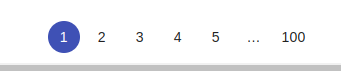
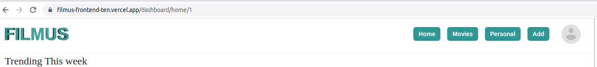
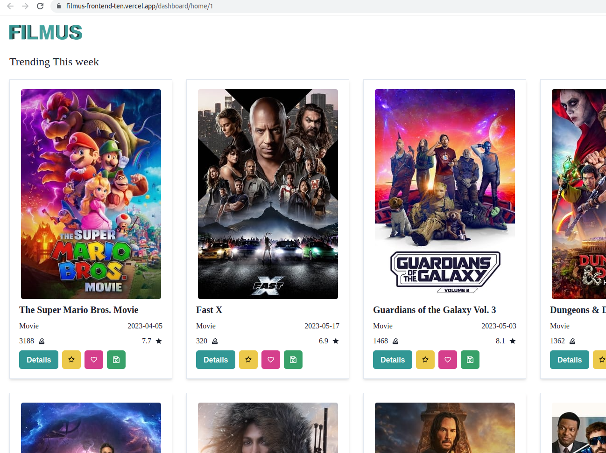
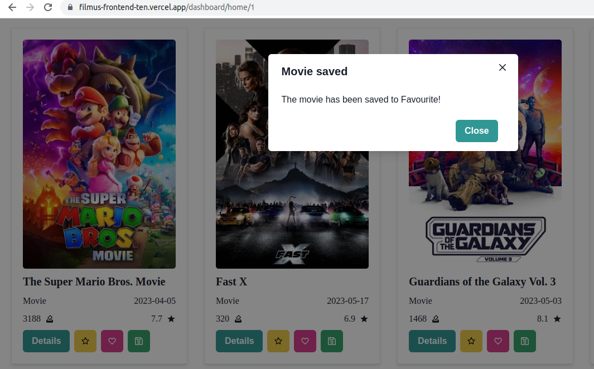
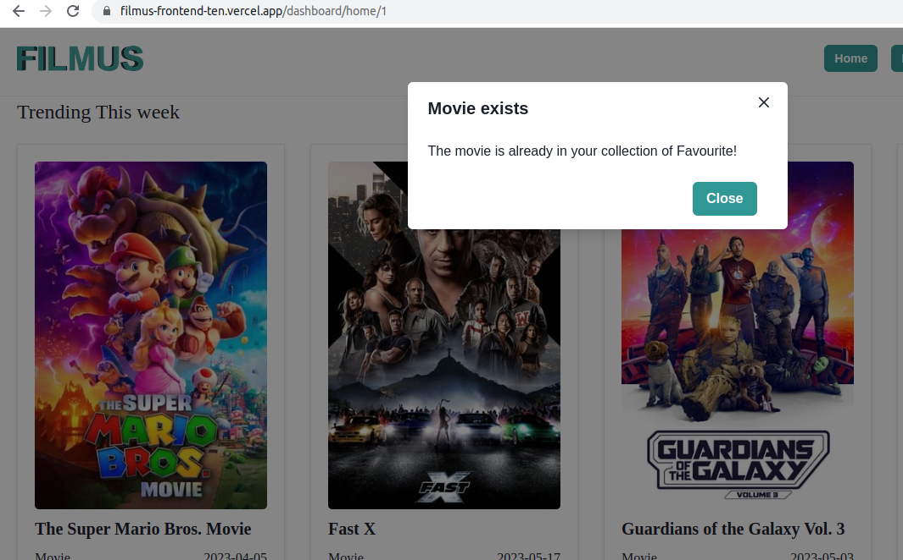
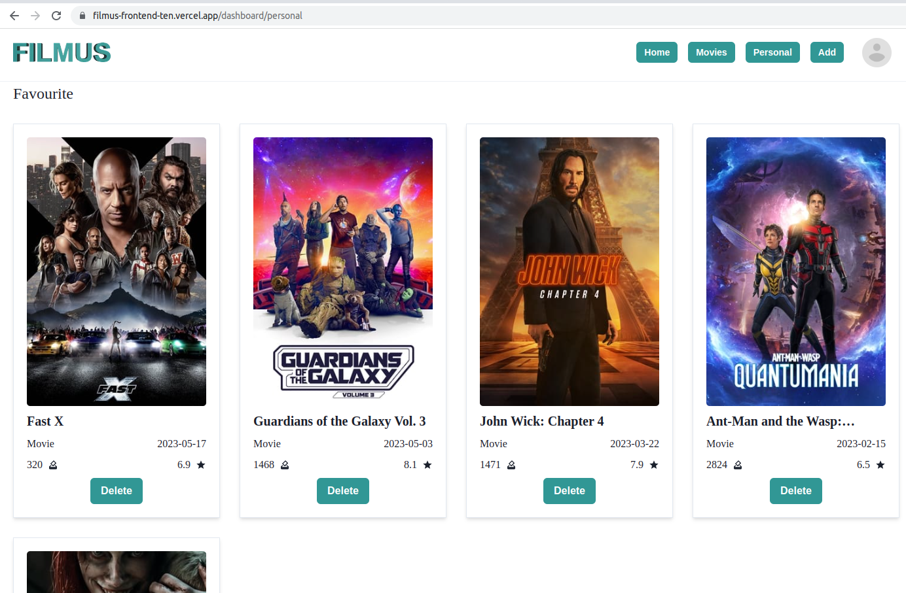
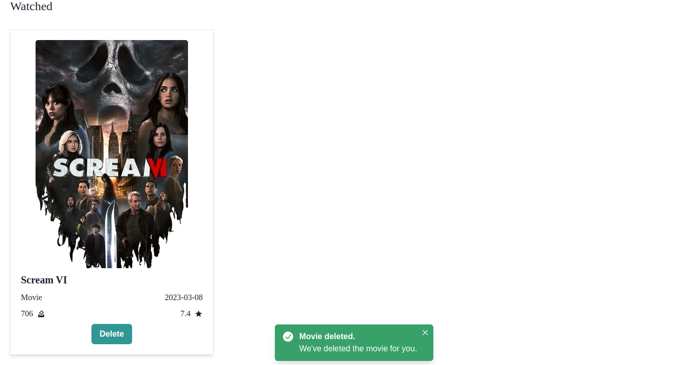
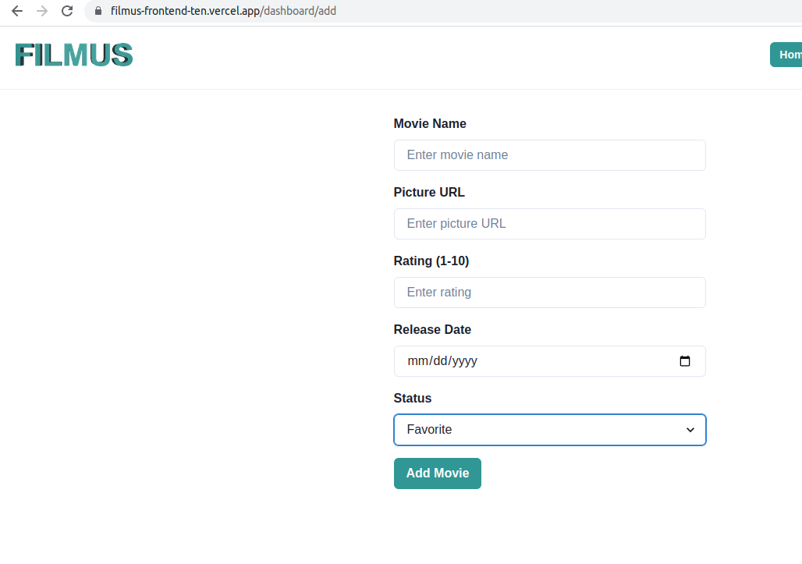
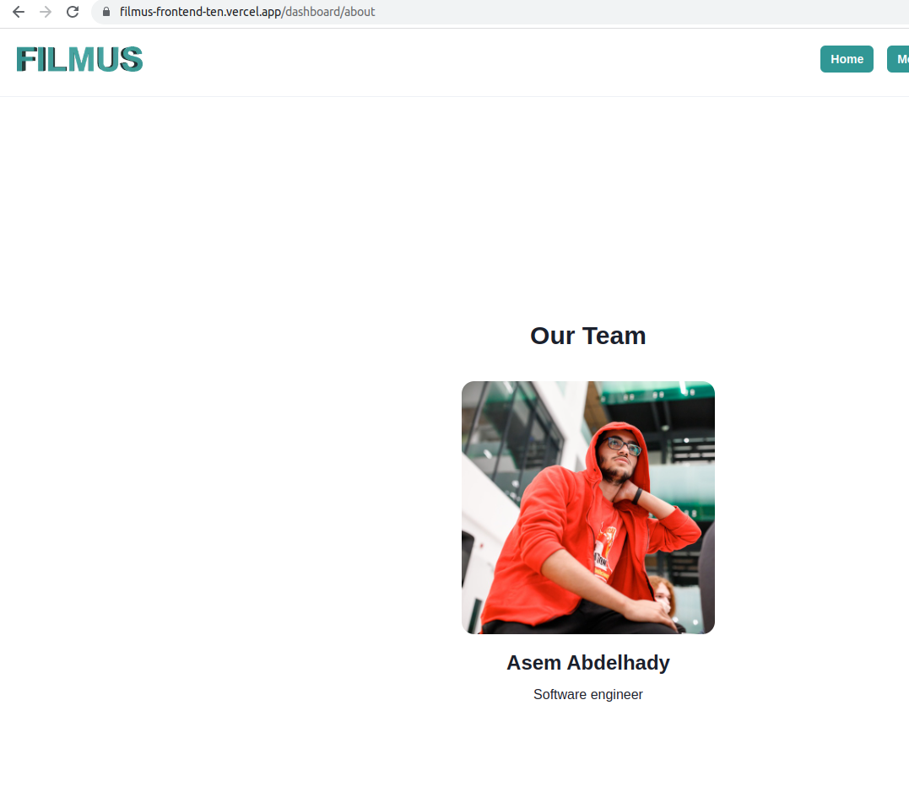
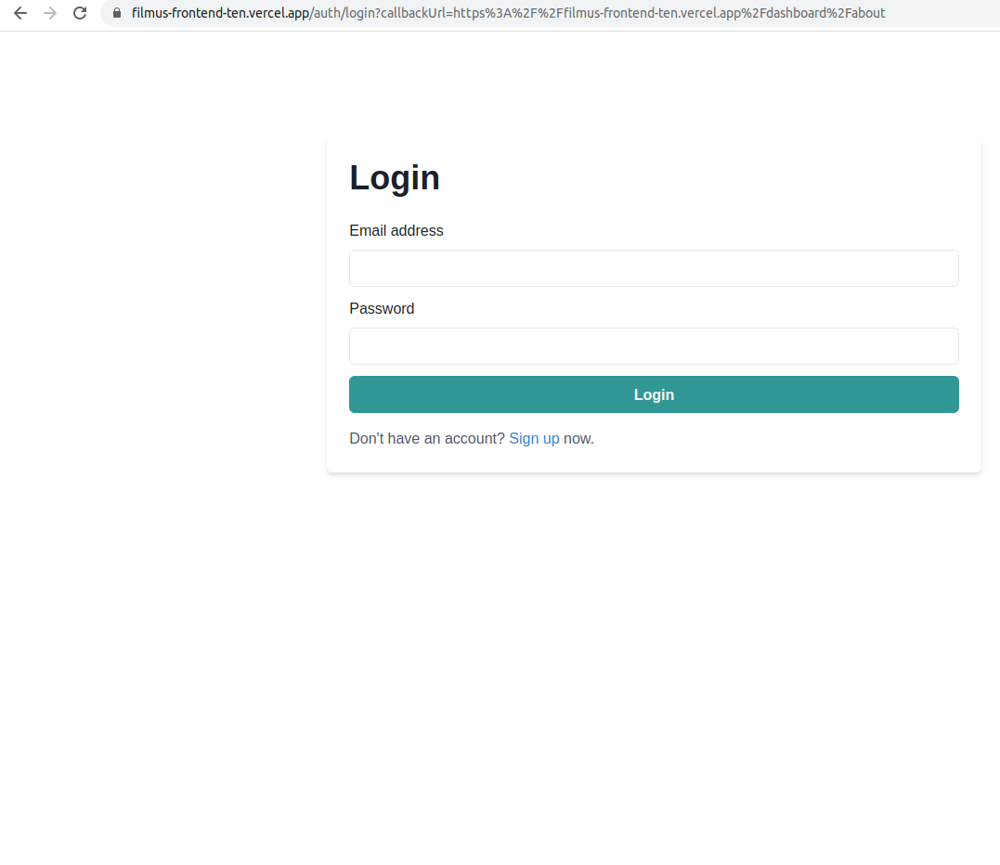

# Filmus frontend

Filmus front-end is a project to interact with Filmus backend. Filmus frontend allows the users to see trending TV shows and movies and give him the options to save it on his own library for watched, to-watch or Favorite. 

## Installation

Run

```bash
yarn install
```

The project uses **[NextAuth](https://next-auth.js.org/)** for JWT token validation. Make sure you have *.env.local* file similar to the *.env_sample*

## Getting Started

First, run the development server:

```bash
npm run dev
# or
yarn dev

```

Open [http://localhost:3000](http://localhost:3000) with your browser to see the result.

You can start editing the page by modifying `pages/index.tsx`. The page auto-updates as you edit the file.

This project uses [`next/font`](https://nextjs.org/docs/basic-features/font-optimization) to automatically optimize and load Inter, a custom Google Font.

## Usage

In ***localhost:3000/home/1*** you will see the latest TV shows in trending. You can navigate through TV shows using the **pagination** component at the bottom of the page:

<p align="center"></p> 

The URL will dynamically change to the current page.

Each TV show has 4 options.

1. Details
2. To watch
3. Favorite 
4. Watched

The first option to see the TV show in details in separated dynamic page. *Note: details page is SSR so the browser does not fetch the movie data.* Second option to add the movie in your personal collection of **"To watch"** so you can watch it later. Third option to add the movie in your personal collection of **"Favorite"**. IT means you watched this show and loved it. Fourth option to add the movie in your personal collection of **"Watched** to know that you watched it before.

You can navigate though the pages and your account info using the **Navbar**

<p align="center"></p> 

Go to personal page to see your collection  

## Visuals

<p align="center"></p> 

<p align="center"></p> 

Or if it is already in Fabourite
<p align="center"></p> 

<p align="center"></p> 

<p align="center"></p>
<p align="center"></p> 

<p align="center"></p>
<p align="center"></p> 

## Deploy on Vercel

I have deployed the front-end using Vercel
